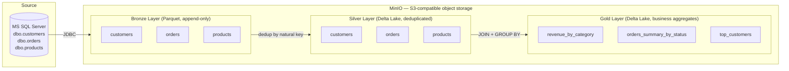

# E-Commerce Lakehouse

A portfolio project demonstrating a **production-grade Medallion Architecture** (Bronze / Silver / Gold) built on an open-source stack. Source data is generated in MS SQL Server and processed through PySpark into MinIO (S3-compatible object storage) using Delta Lake as the storage format.

---

## Architecture



### Layer responsibilities

| Layer | Format | Pattern | Description |
|-------|--------|---------|-------------|
| **Bronze** | Parquet | Append-only | Raw data from SQL Server. Every run appends a new batch with `ingestion_timestamp` and `run_id`. History is never deleted. |
| **Silver** | Delta Lake | Upsert / dedup | One record per business key (latest `ingestion_timestamp` wins). ACID guarantees via Delta. |
| **Gold** | Delta Lake | Overwrite | Business-level aggregates recomputed on every run. Optimised for consumption. |

---

## Tech Stack

| Technology | Role |
|------------|------|
| **PySpark 3.5** | Distributed data processing |
| **Delta Lake 3.2** | ACID transactions, Time Travel on Silver & Gold |
| **MinIO** | S3-compatible local object storage |
| **MS SQL Server 2022** | Source OLTP database (Docker) |
| **Docker Compose** | Local orchestration of services |
| **Python `logging`** | Structured pipeline observability (record counts per stage) |
| **python-dotenv** | Secrets management via `.env` file |

---

## Project Structure

```
ecommerce-lakehouse/
├── .env.example               # Environment variable template (copy to .env)
├── docker/
│   └── docker-compose.yml     # MinIO + SQL Server services
├── data/
│   └── scripts/
│       └── generate_data.py   # Faker-based data generator → SQL Server
├── spark/
│   └── jobs/
│       ├── bronze_layer.py    # SQL Server → Bronze (Parquet, append)
│       ├── silver_layer.py    # Bronze → Silver (Delta, dedup by natural key)
│       └── gold_layer.py      # Silver → Gold (Delta, business aggregates)
├── load_repo_env.py           # Shared helper: loads .env, validates required vars
└── requirements.txt
```

---

## Quick Start

### Prerequisites

- Docker Desktop
- Python 3.10+
- Apache Spark 3.5 installed and `SPARK_HOME` set
- ODBC Driver 17 for SQL Server (for `generate_data.py`)

### 1. Clone and configure

```bash
git clone https://github.com/your-username/ecommerce-lakehouse.git
cd ecommerce-lakehouse
cp .env.example .env
```

Edit `.env` and fill in your values (see `.env.example` for all required variables).

### 2. Start services

Run from the **repo root** so Docker can read `.env`:

```bash
docker compose --env-file .env -f docker/docker-compose.yml up -d
```

| Service | URL |
|---------|-----|
| MinIO Console | http://localhost:9001 |
| MinIO API (S3) | http://localhost:9000 |
| SQL Server | `localhost,1434` |

> SQL Server may take 30–60 seconds to initialise on first start.

### 3. Install Python dependencies

```bash
pip install -r requirements.txt
```

### 4. Generate source data

Inserts 100 customers, 50 products and 500 orders into SQL Server:

```bash
python data/scripts/generate_data.py
```

### 5. Run the pipeline

```bash
# Bronze: ingest raw data from SQL Server → MinIO
python spark/jobs/bronze_layer.py

# Silver: deduplicate by natural key → Delta tables
python spark/jobs/silver_layer.py

# Gold: business aggregates → Delta tables
python spark/jobs/gold_layer.py
```

> Each job logs record counts at every stage — check the console output for observability.

---

## Gold Layer Outputs

### `revenue_by_category`
Revenue and order metrics for **completed** orders, grouped by product category.

| Column | Description |
|--------|-------------|
| `category` | Product category |
| `total_revenue` | Sum of `total_amount` |
| `order_count` | Number of completed orders |
| `avg_order_value` | Average order value |

### `orders_summary_by_status`
Order distribution across all statuses with percentage share.

| Column | Description |
|--------|-------------|
| `status` | Order status (`completed`, `pending`, `cancelled`, `refunded`) |
| `order_count` | Number of orders |
| `total_revenue` | Sum of `total_amount` |
| `pct_of_total` | Percentage share of all orders |

### `top_customers`
Customer ranking by total spend using `DENSE_RANK`.

| Column | Description |
|--------|-------------|
| `customer_id` | Business key |
| `full_name` | First + last name |
| `country` | Customer country |
| `total_spent` | Lifetime order value |
| `order_count` | Total number of orders |
| `rank` | Dense rank by `total_spent` descending |

---

## Design Decisions

**Why append-only Bronze?**
Bronze preserves the full ingestion history. Multiple daily runs produce multiple batches — each identified by `run_id` and `ingestion_timestamp`. Deduplication is delegated to Silver, keeping Bronze simple and auditable.

**Why Delta Lake for Silver and Gold?**
Delta provides ACID transactions and Time Travel. If a Silver run fails mid-write, the previous version remains fully consistent — no partial overwrites. Gold tables can be queried at any historical version with `.option("versionAsOf", n)`.

**Why Parquet for Bronze?**
Bronze is write-heavy and read-rarely. Plain Parquet is simpler, cheaper to write, and avoids Delta transaction log overhead on the raw landing zone.
